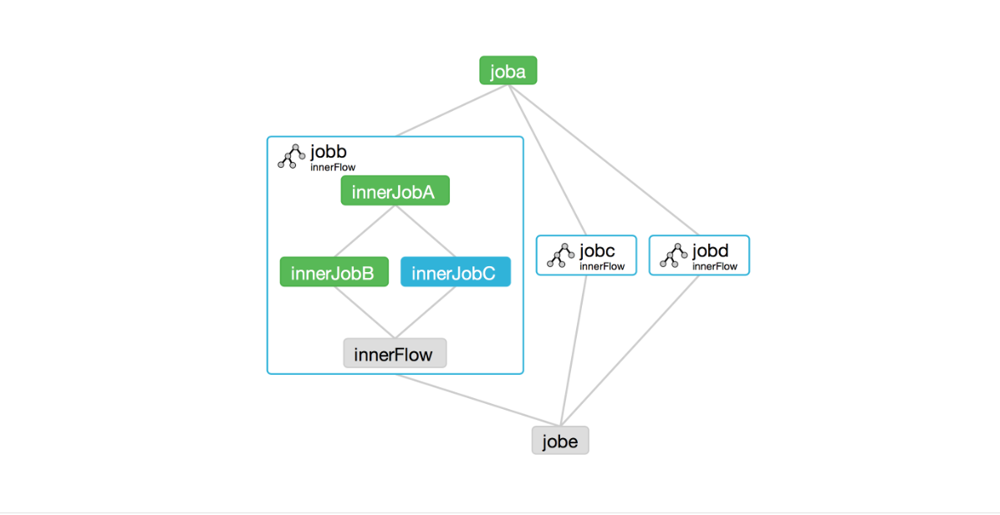

  <h1 align="center">Azkaban Task Scheduler</h1>
  

    <a href="README.md"><strong>English</strong></a> | <strong>简体中文</strong>
  

## Table of Contents

- [Repository Introduction](#repository-introduction)
- [Prerequisites](#prerequisites)
- [Image Specifications](#image-specifications)
- [Getting Help](#getting-help)
- [How to Contribute](#how-to-contribute)

## Repository Introduction
‌[Azkaban‌](https://github.com/azkaban/azkaban) Azkaban is an open source batch workflow task scheduler by LinkedIn that runs a set of jobs and processes in a specific order within a workflow. It helps users manage and track workflows by defining dependencies between tasks and providing a web user interface. Azkaban is suitable for scheduling various types of jobs, such as Command, Hadoop MapReduce, Hive, Spark, and Pig, and supports custom plugins.

**Core Features:**
1. Batch Workflow Scheduling: Azkaban allows users to define and execute workflows with complex dependencies.
2. Web User Interface: Provides an easy-to-use web interface for creating, maintaining, monitoring, and tracking workflows.
3. Task Dependencies: Azkaban uses job configuration files to define dependencies between tasks, ensuring jobs are executed in the correct order.
4. Support for Multiple Job Types: Can schedule various types of jobs, such as Command, Hadoop MapReduce, Hive, Spark, and Pig.
5. Pluggable Plugin Mechanism: Supports custom plugins to extend Azkaban's functionality, such as supporting new job types or integrating with other systems.
6. Distributed Execution: Azkaban can improve scheduling capacity and reliability through multiple executors.
7. Error Handling and Retry: Supports a retry mechanism to automatically retry tasks when they fail.
8. Security Management: Provides authentication and authorization mechanisms to ensure only authorized users can access and operate workflows.
9. History and Auditing: Records job execution history for easy auditing and troubleshooting.

This project offers pre-configured [**`Azkaban-Task Scheduler`**]()，images with Azkaban and its runtime environment pre-installed, along with deployment templates. Follow the guide to enjoy an "out-of-the-box" experience.

**Architecture Design:**

> **System Requirements:**
> - CPU: 4vCPUs or higher
> - RAM: 16GB or more
> - Disk: At least 50GB

## Prerequisites
[Register a Huawei account and activate Huawei Cloud](https://support.huaweicloud.com/usermanual-account/account_id_001.html)

## Image Specifications

| Image Version          | Description | Notes |
|------------------------| --- | --- |
| [Azkaban24.1.3-arm-v1.0](https://github.com/HuaweiCloudDeveloper/azkaban-image/tree/Azkaban24.1.3-arm-v1.0?tab=readme-ov-file) | Deployed on Kunpeng servers with Huawei Cloud EulerOS 2.0 64bit |  |

## Getting Help
- Submit an [issue](https://github.com/HuaweiCloudDeveloper/azkaban-image/issues)
- Contact Huawei Cloud Marketplace product support

## How to Contribute
- Fork this repository and submit a merge request.
- Update README.md synchronously based on your open-source mirror information.